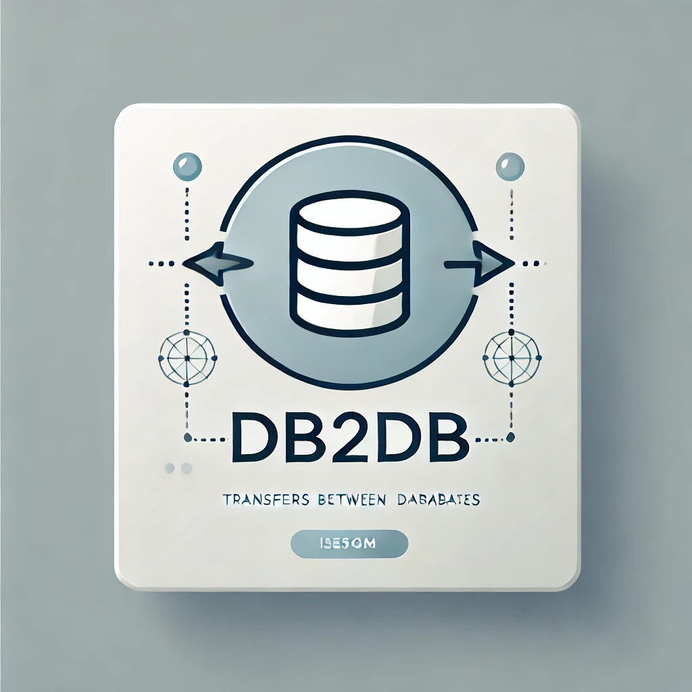

# db2db

`db2db` is a Python package for transferring data between different SQL databases. It supports various database types including PostgreSQL, MySQL, and Microsoft SQL Server.

## Features

- **Data Transfer:** Transfer data between different SQL databases.
- **Supports Multiple Databases:** Includes support for PostgreSQL, MySQL, and MSSQL.
- **Simple Interface:** Easy-to-use API for database operations.

## Installation

You can install `db2db` from PyPI using pip:

```bash
pip install db2db-2
```
## **Usage**

Here is a basic example of how to use `db2db` to transfer data between two databases.

### **Example**

**1.Create a configuration for your source and target databases:**  

```sh
source_db_config = {
    'db_type': 'postgresql',
    'host': 'localhost',
    'database': 'source_db',
    'user': 'your_user',
    'password': 'your_password'
    }

target_db_config = {
    'db_type': 'mysql', 
    'host': 'localhost', 
    'database': 'target_db'  
    'user': 'your_user', 
    'password': 'your_password'`
    }
```


**2.Perform data transfer:**  
```sh
from db2db import transfer_data  
source_table = 'source_table_name'` 
target_table = 'target_table_name'

try:` 
    transfer_data(source_db_config, target_db_config, source_table, target_table) 
    print("Data transfer completed successfully.")  
except Exception as e:` 
    print(f"An error occurred: {e}")
```


## **Configuration**

### **Supported Databases**

* **PostgreSQL**  
* **MySQL**  
* **MSSQL**

### **Connection String Configuration**

The `create_connection_string` function in `db2db.utils` helps generate the connection string based on the database type and configuration parameters.

### **Example Configuration**

```sh 
def create_connection_string(db_type, **kwargs): 
    """
    Create a SQLAlchemy connection string.

    Parameters:  
    - db_type (str): Type of database ('postgresql', 'mysql', 'mssql'). 
    - kwargs (dict): Additional parameters for database connection.

    Returns:  
    - str: SQLAlchemy connection string.  
    """  
    pass  # Implement your function here
```

## **Testing**

To run tests, use the following commands:

**1.Set up the environment:**  
```sh
python -m venv venv  
source venv/bin/activate  # or venv\Scripts\activate on Windows  
pip install -r requirements.txt
```

 

**2.Run the tests:**  
```sh
python -m unittest discover -s tests
```


## **Contributing**

Contributions are welcome\! Please follow these steps to contribute:

1. Fork the repository.  
2. Create a new branch.  
3. Make your changes.  
4. Submit a pull request.

## **License**

This project is licensed under the MIT License \- see the LICENSE file for details.


## **About Me**
I am Akhtar Raza, a Team Lead Software Developer working at Fin Rise Softech Pvt Ltd. I am passionate about creating efficient software solutions and enjoy working on innovative projects.

## **Contact**
For any questions or issues, please contact me at akhtar.decy@gmail.com.

